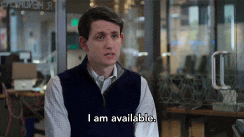

  

  

## 🚀 Sobre Mí

**💻 Ingeniero en Sistemas y Desarrollador Full Stack e IA**

Llevo más de 9 años creando aplicaciones web que realmente funcionan y explorando cómo la IA puede hacer nuestras vidas más fáciles (cuando no tiene alucinaciones). Me encanta el desarrollo full-stack porque me permite ver el panorama completo - desde el backend que nadie ve hasta la interfaz que todos critican. 

🤖 La IA no me va a reemplazar porque yo sé cuándo un bug es un feature.

  
  
  
  

 

**🌐 Idiomas:** Español (Nativo) | Inglés (Avanzado)

## 💼 Disponible para Contratación

  

  
  
  

## 🛠️ Stack Tecnológico

  
    

## 🌟 Especializaciones Principales

<table align="center">
<tr>
<td align="center" width="120">
  
   <strong>Laravel</strong>
   <small>APIs Empresariales</small>
</td>
<td align="center" width="120">
  
   <strong>Python</strong>
   <small>IA y ML</small>
</td>
<td align="center" width="120">
  
   <strong>NestJS</strong>
   <small>Backend Escalable</small>
</td>
<td align="center" width="120">
  
   <strong>React</strong>
   <small>UIs Dinámicas</small>
</td>
<td align="center" width="120">
  
   <strong>Nuxt</strong>
   <small>SSR y Rendimiento</small>
</td>
</tr>
</table>

## 📫 Conectemos y Colaboremos

  
  
  
  

  
  
  
  

## 🖤 En Memoria

  

    <strong>"Si puedes imaginarlo, puedes programarlo"</strong>
     
    <small>- Alejandro Taboada ✝️</small>
     
    <small style="opacity: 0.8;">Una leyenda de la programación que siempre recordaremos</small>
  

  

